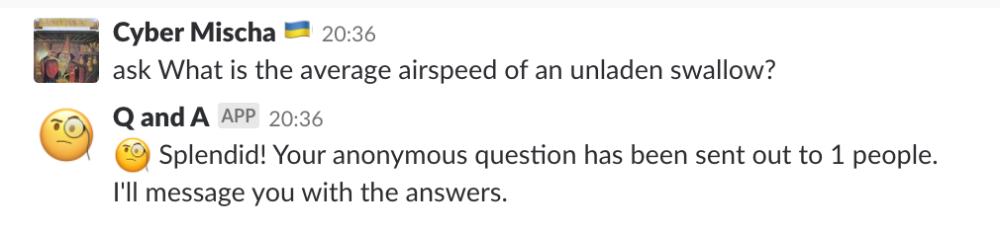
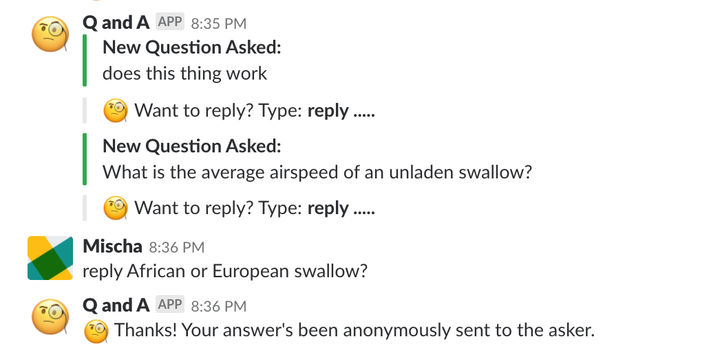
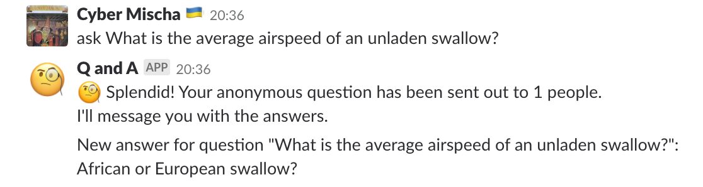
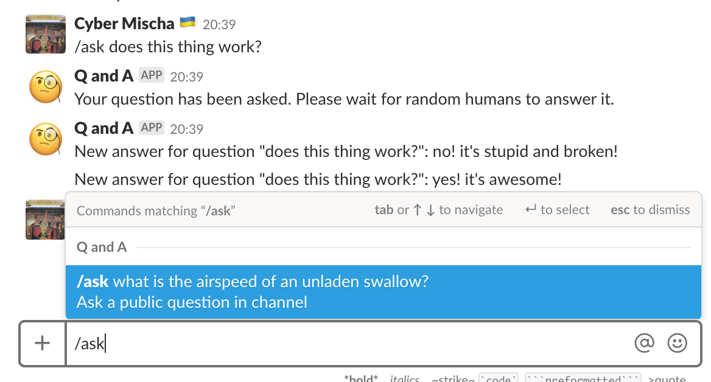

## Ask a question; answer a question.

This is an app for Slack and SMS that lets anyone ask a question or answer a question.
You can ask a question anonymously or in a channel.
All answers are anonymous.

## How it works:
Once you've [added the app](https://slack.com/oauth/authorize?client_id=303250292951.355565480789&scope=commands,bot,channels:history,chat:write:bot) to Slack, you can either send a private message to @QAndA or type `/ask` to ask a public question in the current channel.

# Private questions:

---

---

---

# Public questions:

## About
This bot is open-source and is completely serverless.
It is built with AWS Lambda, DynamoDB, Flask, Python 3, Twilio, and Slack. PRs welcome!
